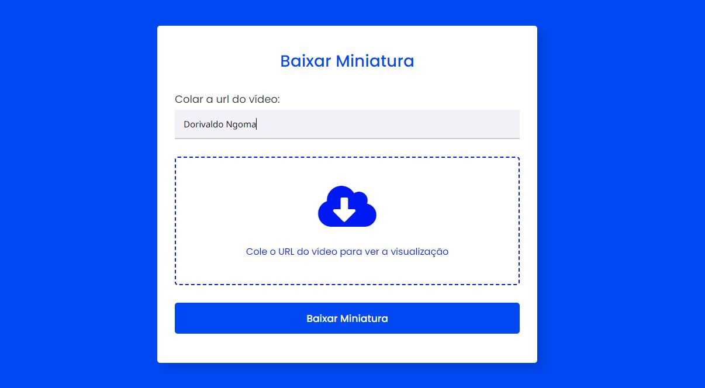

# Baixar a miniatura do vídeo do YouTube com PHP e JS

## Sobre o projecto

Formulário HTML, CSS, JS e PHP para Visualização e Download de Miniaturas de Vídeos do YouTube.

Este projeto tem como objectivo criar um formulário que permita aos usuários visualizar e baixar miniaturas de vídeos do YouTube. Foram utilizadas as linguagens HTML, CSS e JavaScript para a parte do front-end, enquanto o PHP foi responsável por buscar e baixar as imagens a partir das URLs fornecidas.
